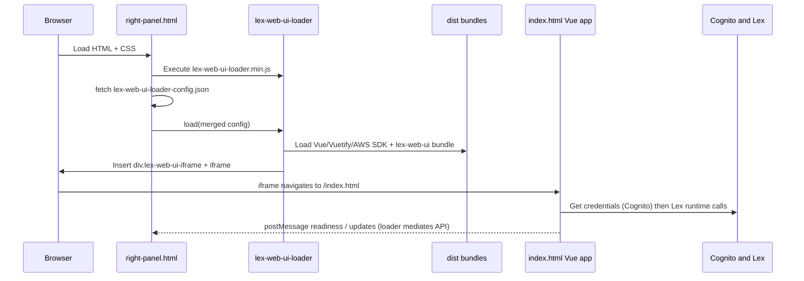

# Knowledge transfer: this fork vs [aws-samples/aws-lex-web-ui](https://github.com/aws-samples/aws-lex-web-ui/tree/master)

This guide is written for someone new to the codebase. It explains—in plain language—how the **official sample** works, what **this repository** changed, and how **`right-panel.html`** (and the floating **iframe “box”**) fits into the full path from opening a page to seeing Lex replies.

For a shorter companion doc about the toolbar **Offline / Connecting… / Online** indicator, see [online-status-indicator.md](./online-status-indicator.md).

---

## Table of contents

1. [Big picture: what problem does this project solve?](#1-big-picture-what-problem-does-this-project-solve)
2. [Official sample vs this fork (one-page summary)](#2-official-sample-vs-this-fork-one-page-summary)
3. [Important vocabulary](#3-important-vocabulary)
4. [How configuration reaches the chat UI](#4-how-configuration-reaches-the-chat-ui)
5. [The host page and the “box”: `right-panel.html` in depth](#5-the-host-page-and-the-box-right-panelhtml-in-depth)
6. [How the iframe is created and loaded (technical path)](#6-how-the-iframe-is-created-and-loaded-technical-path)
7. [End-to-end flow: from opening `right-panel.html` to a Lex response](#7-end-to-end-flow-from-opening-right-panelhtml-to-a-lex-response)
8. [Files that differ from upstream (by role)](#8-files-that-differ-from-upstream-by-role)
9. [Where to change what (quick reference)](#9-where-to-change-what-quick-reference)
10. [Local development and why `dist/` exists](#10-local-development-and-why-dist-exists)
11. [Broader repository differences (beyond the chat UI)](#11-broader-repository-differences-beyond-the-chat-ui)

---

## 1. Big picture: what problem does this project solve?

**Amazon Lex** is AWS’s chatbot engine. It does **not** ship a ready-made website that looks like your brand.

**aws-lex-web-ui** (the upstream project) provides:

- A **Vue.js** chat application (the “Lex Web UI” component).
- A **loader** (`lex-web-ui-loader`) that can inject that app either as a **full page** or inside an **iframe** embedded in your site.
- **Configuration** (JSON) that points the browser to your **Lex bot** and **Cognito Identity Pool** so the browser can call Lex **safely** (temporary AWS credentials, not long-lived secrets in the page).

**This fork** keeps that architecture, but customizes the **look**, **sample host pages**, **onboarding**, **toolbar**, **responsive iframe shell**, and **runtime config** for your bot and Cognito pool.

---

## 2. Official sample vs this fork (one-page summary)

| Topic | [Upstream `master`](https://github.com/aws-samples/aws-lex-web-ui/tree/master) | This fork |
|--------|------------------|-----------|
| Primary iframe demo page | [`src/website/parent.html`](https://github.com/aws-samples/aws-lex-web-ui/blob/master/src/website/parent.html) — Bootstrap/jQuery demo with panels that show Lex state | Same file **updated** (fetch config, origins), plus a **new** [`src/website/right-panel.html`](../src/website/right-panel.html): a cleaner “portal + right chat” mock layout |
| Floating panel styling | Default sizing from loader CSS [`src/lex-web-ui-loader/css/lex-web-ui-iframe.css`](../src/lex-web-ui-loader/css/lex-web-ui-iframe.css) (e.g. `80vh`, `66vw`) | **Page-level CSS** in `right-panel.html` **overrides** those rules for a **fixed right column**, **responsive breakpoints**, **full-screen on mobile**, and a **pinned bottom-right** minimized launcher |
| Local dev entry | `npm start` serves sample pages (see upstream README) | [`server.js`](../server.js) serves **`dist/`** and highlights **`/right-panel.html`**; also serves `/bot-config` for your icon and extra JSON |
| Bot connection values | Placeholders until you deploy or edit config | [`src/config/lex-web-ui-loader-config.json`](../src/config/lex-web-ui-loader-config.json) filled with **your** `v2BotId`, `v2BotAliasId`, `v2BotLocaleId`, `cognito.poolId`, UI strings, onboarding, quick replies |
| Onboarding | Not the default focus of upstream samples | Custom onboarding in Vue; **panel stays open** after submit (no auto-minimize) |
| Toolbar “online” dot | Upstream behavior / styling as shipped | **Three states** driven by Vuex: Offline / Connecting… / Online — see [online-status-indicator.md](./online-status-indicator.md) |

---

## 3. Important vocabulary

| Term | Plain meaning |
|------|----------------|
| **Host page** | The normal web page the user opens first (here: `right-panel.html`). It is **not** the chat app itself; it **wraps** the chat. |
| **Loader** | JavaScript (`lex-web-ui-loader*.js`) that downloads dependencies, reads config, creates a **div** + **iframe**, and wires parent ↔ iframe messaging. |
| **iframe** | A separate browser frame that loads another URL (`index.html` with special query flags). The Lex Web UI runs **inside** that frame. |
| **`lex-web-ui-loader-config.json`** | The main JSON file with Cognito pool, Lex bot IDs, UI labels, iframe behavior, etc. |
| **`dist/`** | Built/copied files your server actually sends to the browser (bundles + copied HTML/CSS). |
| **`lex-web-ui/`** | Source of the Vue chat app (components, Vuex store, Lex client). |
| **Embed mode** | The iframe URL includes `lexWebUiEmbed=true` so the inner app knows it is embedded and can talk to the parent loader. |

---

## 4. How configuration reaches the chat UI

Think of **three layers** (outer to inner):

1. **Host page script** (`right-panel.html` bottom script)  
   - Optionally adjusts config in JavaScript (this fork sets `parentOrigin`, `iframeOrigin`, and can override `shouldLoadIframeMinimized` for the session).

2. **`lex-web-ui-loader-config.json`**  
   - The **baseline** product settings: Lex, Cognito, UI text, iframe path, feature flags.

3. **Inner Vue app** (`lex-web-ui` bundle)  
   - Reads merged config at startup and while running (e.g. sends messages with `sessionAttributes`).

**Same-origin note:** For local testing, the parent page, loader, bundles, and `index.html` are all served from `http://localhost:8000/`. That avoids many cross-origin iframe headaches. Production often uses CloudFront/S3 the same way.

---

## 5. The host page and the “box”: `right-panel.html` in depth

### 5.1 What the HTML file actually contains

[`src/website/right-panel.html`](../src/website/right-panel.html) has **two** unrelated-looking parts that work together:

1. **Decorative “fake portal” layout** (`.page-shell`, `.page-content`, headings)  
   - This is only to mimic a real site. It is **not** required for Lex. You could delete it and keep only the scripts.

2. **Invisible wiring** (scripts at the bottom)  
   - Loads `lex-web-ui-loader.min.js`, creates `IframeLoader`, **fetches** JSON config, then calls `load(cfg)`.

### 5.2 Where the “box” comes from

The gray/white **floating panel** is **not** spelled out as `<iframe>` in your HTML file.

The loader **injects** a container element into the page. Defaults (see [`src/lex-web-ui-loader/js/defaults/loader.js`](../src/lex-web-ui-loader/js/defaults/loader.js)) use:

- **Element id:** `lex-web-ui-iframe`
- **Container class:** `lex-web-ui-iframe`
- **Iframe URL:** `iframeOrigin` + `iframe.iframeSrcPath` (typically `/index.html#/?lexWebUiEmbed=true`)

So your CSS class **`.lex-web-ui-iframe { ... }`** in `right-panel.html` styles the **loader-created wrapper** around the real `<iframe>`.

### 5.3 Why there are two sources of “box” CSS (important nuance)

1. **Loader CSS** — linked as `lex-web-ui-loader.min.css` in the `<head>`. It contains the **default** floating iframe rules from [`lex-web-ui-iframe.css`](../src/lex-web-ui-loader/css/lex-web-ui-iframe.css) (upstream-style dimensions, `display: none` until shown, etc.).

2. **Inline `<style>` in `right-panel.html`** — comes **after** in the document and uses **`!important`** in many places to **override** the defaults.

**Takeaway:** When you tweak panel size, position, or shadows, you are usually editing **`right-panel.html` inline styles**, not only the loader CSS. If something “does not change,” check whether an `!important` rule or breakpoint order is winning.

### 5.4 What each major CSS block is trying to do

Below is a **conceptual** reading of the custom rules (not line-by-line).

| CSS area | Purpose |
|----------|---------|
| `* { box-sizing: border-box; }` | Makes width/height math predictable when mixing padding and borders. |
| `.page-shell` / `.page-content` | Fake portal background and readable content column; `padding-right` reserves space so text does not sit under the chat on wide screens. |
| `.lex-web-ui-iframe` (expanded panel) | **Desktop:** fixed right “column”: `clamp(320px, 36vw, 460px)` width, `calc(100dvh - 24px)` height, rounded corners, shadow, flex layout so the inner iframe stretches. Uses `opacity` + `transform` for a soft entrance; `.lex-web-ui-iframe--show` enables interaction. |
| `@media (max-width: 1024px)` | **Tablet:** slightly narrower panel, smaller margins from screen edges. |
| `@media (max-width: 768px)` | **Mobile:** panel becomes **full viewport** (`100vw` × `100dvh`), no rounded corners—behaves like a full-screen app. |
| `.lex-web-ui-iframe--minimize` | **Minimized** state: small circular “launcher” region pinned with **`position: fixed`**, explicit `right` / `bottom`, neutralized transforms, **no** outer box-shadow / transparent background (removes the “white halo” around the icon). |
| `@media (prefers-reduced-motion: reduce)` | Respects user OS setting: disables motion transitions. |

**Why `position: fixed !important` on minimize:** Responsive layouts and parent transforms can accidentally make `absolute` positioning anchor to the wrong ancestor. `fixed` + explicit `right`/`bottom` keeps the launcher **visually** in the bottom-right corner across breakpoints.

### 5.5 What the bottom `<script>` block does (line-by-line idea)

| Code idea | Why it exists |
|-----------|----------------|
| `baseUrl: origin + '/'` | Tells the loader where to load dependency scripts and bundles from (your site root). |
| `shouldLoadConfigFromJsonFile: false` | “Do not auto-fetch the default config URL inside the loader”; this page **already** `fetch`es JSON manually for extra control. |
| `fetch(origin + '/lex-web-ui-loader-config.json')` | Loads your **real** Lex/Cognito/UI settings from the server. |
| `cfg.ui.parentOrigin = origin` | Security / messaging: parent page origin for postMessage-style integration. |
| `cfg.iframe.iframeOrigin = origin` | Tells the loader which origin builds the inner iframe URL. |
| `cfg.iframe.shouldLoadIframeMinimized = false` | Host page **forces** first paint expanded for this demo (even if JSON says minimized by default). |
| `iframeLoader.load(cfg)` | Starts dependency loading, iframe creation, handshake—see next section. |

---

## 6. How the iframe is created and loaded (technical path)

High-level sequence:

**Implementation detail:** The loader’s iframe logic lives under [`src/lex-web-ui-loader/`](../src/lex-web-ui-loader/). After you change loader source, you rebuild loader bundles into `dist/` (your team’s workflow uses `npm run build-dist` and [`build/copy-assets.js`](../build/copy-assets.js)).

**Small fork fix in the loader:** [`iframe-component-loader.js`](../src/lex-web-ui-loader/js/lib/iframe-component-loader.js) guards **localStorage** keys when Cognito **app client id** is missing—upstream assumed it always exists; this avoids runtime errors in some configs.

---

## 7. End-to-end flow: from opening `right-panel.html` to a Lex response

1. User opens `http://localhost:8000/right-panel.html` (or your deployed URL). [`server.js`](../server.js) serves the file from **`dist/right-panel.html`**, which is kept in sync from **`src/website/right-panel.html`** when you run the copy script.

2. Browser parses `<head>`: loads **`lex-web-ui-loader.min.css`** (default iframe + loader UI styles), then your **inline overrides**.

3. Body renders the decorative portal content (optional).

4. Bottom scripts run:
   - Load **`lex-web-ui-loader.min.js`**.
   - Build `loaderOpts`, construct `new ChatBotUiLoader.IframeLoader(loaderOpts)`.
   - Fetch **`/lex-web-ui-loader-config.json`** (from `src/config` via static middleware in dev).
   - Patch origins and minimized flag; call **`load(cfg)`**.

5. Loader injects **`#lex-web-ui-iframe`** (or configured id), sets classes (`lex-web-ui-iframe`, later `lex-web-ui-iframe--show`, toggles `lex-web-ui-iframe--minimize` when user minimizes).

6. Inner **`/index.html#/?lexWebUiEmbed=true`** loads the Vue app bundle (`lex-web-ui.min.js`, CSS, etc.).

7. Vue app reads config, shows **onboarding** if enabled; on **Start Chatting**, it stores session attributes and triggers the first bot interaction (see [`LexWeb.vue`](../lex-web-ui/src/components/LexWeb.vue)).

8. Vuex actions (e.g. [`lexPostText` in `actions.js`](../lex-web-ui/src/store/actions.js)) refresh credentials and call **Lex runtime** (AWS SDK). Bot replies update the store; message list re-renders.

9. Toolbar and avatars read UI config (e.g. `toolbarLogo`, `avatarImageUrl` pointing at **`/bot-config/bot-icon.png`**).

---

## 8. Files that differ from upstream (by role)

The list below is from a direct comparison of this repo to **`origin/master`** of [aws-samples/aws-lex-web-ui](https://github.com/aws-samples/aws-lex-web-ui/tree/master) for the **chat UI and embedding** surface area. It is the set you touch most often for product behavior.

### Host pages, styles, and static config

| File | Role |
|------|------|
| [`src/website/right-panel.html`](../src/website/right-panel.html) | **New** host page: portal mock + **responsive iframe shell** + loader bootstrap |
| [`src/website/parent.html`](../src/website/parent.html) | Upstream-style iframe demo, **updated** fetch/orcharding similar to `right-panel` |
| [`src/website/custom-chatbot-style.css`](../src/website/custom-chatbot-style.css) | Global visual overrides (toolbar, onboarding, dots, etc.) copied to `dist/` |
| [`src/config/lex-web-ui-loader-config.json`](../src/config/lex-web-ui-loader-config.json) | **Primary** runtime configuration for local and deployment |
| [`bot-config/config.json`](../bot-config/config.json) | Extra bot-facing JSON and assets path; served under **`/bot-config`** |

### Vue application (behavior and branding)

| File | Role |
|------|------|
| [`lex-web-ui/src/components/LexWeb.vue`](../lex-web-ui/src/components/LexWeb.vue) | Shell of the chat app: onboarding completion, initial utterance, **no auto-minimize** after onboarding |
| [`lex-web-ui/src/components/OnboardingForm.vue`](../lex-web-ui/src/components/OnboardingForm.vue) | Onboarding UI copy/structure |
| [`lex-web-ui/src/components/ToolbarContainer.vue`](../lex-web-ui/src/components/ToolbarContainer.vue) | Toolbar layout, logo spacing, **connection status** text and dot |
| [`lex-web-ui/src/components/MinButton.vue`](../lex-web-ui/src/components/MinButton.vue) | Minimized launcher button; shadow/transparent halo fixes |
| [`lex-web-ui/src/components/DefaultQuickReplies.vue`](../lex-web-ui/src/components/DefaultQuickReplies.vue) | Starter chips for common intents |

### Vuex store (Lex lifecycle and status)

| File | Role |
|------|------|
| [`lex-web-ui/src/store/state.js`](../lex-web-ui/src/store/state.js) | Adds `lex.connectionStatus` (`offline` / `connecting` / `online`) |
| [`lex-web-ui/src/store/mutations.js`](../lex-web-ui/src/store/mutations.js) | `setLexConnectionStatus` |
| [`lex-web-ui/src/store/actions.js`](../lex-web-ui/src/store/actions.js) | Sets status around Lex calls; **`testLexConnection`** for immediate “Connecting…” after onboarding |

### Loader and local server

| File | Role |
|------|------|
| [`src/lex-web-ui-loader/js/defaults/loader.js`](../src/lex-web-ui-loader/js/defaults/loader.js) | Default loader options (e.g. embed config behavior) |
| [`src/lex-web-ui-loader/js/lib/iframe-component-loader.js`](../src/lex-web-ui-loader/js/lib/iframe-component-loader.js) | **localStorage** guards for minimize state |
| [`server.js`](../server.js) | Express static server: `dist/`, `src/config`, `bot-config/` |
| [`build/copy-assets.js`](../build/copy-assets.js) | Copies **`right-panel.html`** and **`custom-chatbot-style.css`** into `dist/` after builds |

**Built output:** Files under **`dist/`** (for example `dist/right-panel.html`, `dist/lex-web-ui.min.js`) are **generated or copied**. Treat **`src/`** and **`lex-web-ui/src/`** as the source of truth; rebuild when you change them.

---

## 9. Where to change what (quick reference)

| I want to… | Start here |
|------------|------------|
| Change **panel size**, **mobile full-screen**, **launcher corner** | [`src/website/right-panel.html`](../src/website/right-panel.html) inline `<style>` |
| Change **Lex bot**, **alias**, **locale**, **Cognito pool** | [`src/config/lex-web-ui-loader-config.json`](../src/config/lex-web-ui-loader-config.json) |
| Change **titles**, **onboarding text**, **quick replies** | Same JSON, `ui` and `lex` sections |
| Change **bot logo** image | Put image in `bot-config/` and set `ui.toolbarLogo` / `ui.avatarImageUrl` |
| Change **chat logic**, onboarding flow, **when first message sends** | [`lex-web-ui/src/components/LexWeb.vue`](../lex-web-ui/src/components/LexWeb.vue) |
| Change **toolbar** layout / **status** | [`lex-web-ui/src/components/ToolbarContainer.vue`](../lex-web-ui/src/components/ToolbarContainer.vue) |
| Change **when** “Connecting…” appears | [`lex-web-ui/src/store/actions.js`](../lex-web-ui/src/store/actions.js) + [`LexWeb.vue`](../lex-web-ui/src/components/LexWeb.vue) |
| Change **default iframe dimensions** (if you remove page overrides) | [`src/lex-web-ui-loader/css/lex-web-ui-iframe.css`](../src/lex-web-ui-loader/css/lex-web-ui-iframe.css) |

---

## 10. Local development and why `dist/` exists

- **Run:** from repo root, `npm install` then `npm start` (see upstream README pattern).
- **Open:** [`server.js`](../server.js) prints `http://localhost:8000/right-panel.html`.

**Why two copies of `right-panel.html`?**

- **Source:** [`src/website/right-panel.html`](../src/website/right-panel.html) — edit this.
- **Served copy:** [`dist/right-panel.html`](../dist/right-panel.html) — produced by [`build/copy-assets.js`](../build/copy-assets.js).

After Vue or store changes, run your bundle pipeline (`npm run build-dist` from project conventions) and the copy script so the browser sees updates.

---

## 11. Broader repository differences (beyond the chat UI)

If you run `git diff --stat origin/master...HEAD` from this fork, you may see **many** files outside `src/website` and `lex-web-ui`—for example under **`templates/`** or deployment helpers. Those changes are **infrastructure and packaging** experiments, not required to understand **how `right-panel.html` hosts the iframe**.

When onboarding a **frontend engineer**, focus on:

1. `src/website/right-panel.html`
2. `src/config/lex-web-ui-loader-config.json`
3. `lex-web-ui/src/components/*` and `lex-web-ui/src/store/*`
4. `dist/` as runtime output

---

## Suggested reading order for a new engineer

1. This document (fork context + iframe box).
2. Upstream README sections on **Iframe** and **Configuration** for the official mental model: [aws-samples/aws-lex-web-ui](https://github.com/aws-samples/aws-lex-web-ui/tree/master).
3. [online-status-indicator.md](./online-status-indicator.md) for the **connection status** behavior.

---

*Document generated for internal KT. Upstream comparisons reference `origin/master` of `aws-samples/aws-lex-web-ui` as fetched in your Git clone; line-level upstream content may drift as that repository evolves.*
