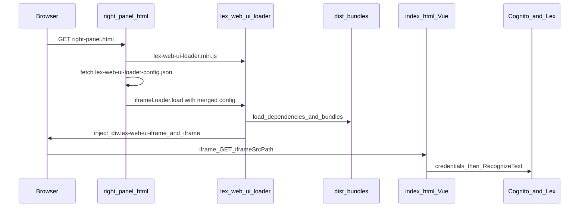

# Playbook: implement `right-panel.html` on a fresh [aws-samples/aws-lex-web-ui](https://github.com/aws-samples/aws-lex-web-ui) fork

This document is a **step-by-step implementation guide** for engineers who clone **upstream** `aws-samples/aws-lex-web-ui` and want the same **right-side floating Lex panel** pattern used in this fork. It complements the conceptual overview in [FORK-KNOWLEDGE-TRANSFER.md](./FORK-KNOWLEDGE-TRANSFER.md) and does not repeat the full repository map.

**Related docs**

- [FORK-KNOWLEDGE-TRANSFER.md](./FORK-KNOWLEDGE-TRANSFER.md) — vocabulary, end-to-end flow, file roles vs upstream.
- [online-status-indicator.md](./online-status-indicator.md) — toolbar Offline / Connecting… / Online (optional **Tier B** UX in this fork).

---

## 1. Scope: two implementation tiers

### Tier A — Minimal (iframe shell works)

Everything required so **`/right-panel.html`** loads the loader, fetches config, injects the **`lex-web-ui-iframe`** container, and the inner **`index.html`** runs Lex with valid Cognito + bot settings.

| You add or change | Purpose |
|-------------------|--------|
| New host page `src/website/right-panel.html` | Layout + CSS overrides + loader bootstrap |
| `right-panel.html` (and optionally `custom-chatbot-style.css`) present under **`dist/`** | Browsers load static files from `dist/` in typical local and S3/CloudFront setups |
| Optional: extend [`build/copy-assets.js`](../build/copy-assets.js) | Automate copy `src/website` → `dist` after each build |
| Valid [`src/config/lex-web-ui-loader-config.json`](../src/config/lex-web-ui-loader-config.json) | Lex V2 IDs, Cognito pool, `iframe.iframeSrcPath`, `ui.parentOrigin` alignment |

**Tier A does not require** any Vue source edits under `lex-web-ui/src/`.

### Tier B — Full product UX (this fork only)

Onboarding copy, toolbar branding, **3-state connection status**, `MinButton` halo fixes, etc. Those live in Vue components, Vuex, and [`src/website/custom-chatbot-style.css`](../src/website/custom-chatbot-style.css). See §8 and [FORK-KNOWLEDGE-TRANSFER.md §8](./FORK-KNOWLEDGE-TRANSFER.md#8-files-that-differ-from-upstream-by-role).

---

## 2. Upstream baseline (what a fresh clone already has)

- **Official iframe sample page:** [`src/website/parent.html`](https://github.com/aws-samples/aws-lex-web-ui/blob/master/src/website/parent.html) — Bootstrap/jQuery demo; **no** `right-panel.html` in upstream.
- **Official local server:** [`server.js`](https://github.com/aws-samples/aws-lex-web-ui/blob/master/server.js) serves **`src/config`** and **`dist/`** at the site root ([Express static](https://expressjs.com/en/starter/static-files.html) order: config first, then dist).

This fork’s [`server.js`](../server.js) **adds** (optional for Tier A unless you use `/bot-config` URLs in JSON):

- `app.use('/bot-config', express.static('bot-config'))` — serves bot icon and extra JSON without copying into `dist/`.
- `app.use('/web-lex-standalone', express.static('web-lex-standalone'))` — alternate static bundle path.
- Console hint to open **`/right-panel.html`**.

---

## 3. Prerequisites checklist (before adding HTML)

Complete these on the **fresh fork** (follow upstream README for exact commands; this repo commonly uses root `npm install`, then `lex-web-ui` install, then `npm run build-dist` and `node build/copy-assets.js` if that script exists).

1. **`dist/` contains the loader and component bundles**, including at minimum:
   - `lex-web-ui-loader.min.js`, `lex-web-ui-loader.min.css`
   - Vue / Vuetify / Vuex / AWS SDK copies from `src/dependencies` (or CDN strategy upstream documents)
   - `lex-web-ui.min.js`, `lex-web-ui.min.css` (names may vary slightly by version—match what `parent.html` expects in the same tree)

2. **`dist/index.html`** (or the path you set in config) exists — the iframe **src** is built from `iframe.iframeOrigin` + `iframe.iframeSrcPath`.

3. **[`src/config/lex-web-ui-loader-config.json`](../src/config/lex-web-ui-loader-config.json)** is filled with **non-placeholder** values at least for:
   - `cognito.poolId`
   - `lex.v2BotId`, `lex.v2BotAliasId`, `lex.v2BotLocaleId` (locale must match what the **alias** serves, or Lex returns `ValidationException`)
   - `iframe.iframeSrcPath` — this fork uses:

   ```json
   "iframeSrcPath": "/index.html#/?lexWebUiEmbed=true"
   ```

4. If opening `right-panel.html` shows a **blank page or immediate script error**, check the browser **Network** tab: missing `lex-web-ui-loader.min.js` almost always means **`dist/` was not built or not copied**.

---

## 4. Tier A — Step-by-step implementation

### Step 4.1 — Add the host page under `src/website/`

Copy the canonical file from this fork:

- Source of truth: [`src/website/right-panel.html`](../src/website/right-panel.html)

**Head section (required pieces):**

- `<link href="./lex-web-ui-loader.min.css" rel="stylesheet" />` — loads default iframe chrome from the loader bundle (see [`src/lex-web-ui-loader/css/lex-web-ui-iframe.css`](../src/lex-web-ui-loader/css/lex-web-ui-iframe.css)).
- Inline `<style>...</style>` — **overrides** loader defaults for responsive right panel, full-screen mobile, pinned minimize button (see §5.2).

**Body end (loader bootstrap)** — same pattern as upstream `parent.html`, with explicit `fetch` and host-side config patches. Reference implementation:

```217:241:src/website/right-panel.html
  <script src="./lex-web-ui-loader.min.js"></script>
  <script>
    (function () {
      var origin = window.location.origin;
      var loaderOpts = {
        baseUrl: origin + '/',
        shouldLoadConfigFromEvent: false,
        shouldLoadConfigFromJsonFile: false,
        shouldLoadMinDeps: true,
      };
      var IframeLoader = window.ChatBotUiLoader.IframeLoader;
      var iframeLoader = new IframeLoader(loaderOpts);
      fetch(origin + '/lex-web-ui-loader-config.json')
        .then(function (r) { return r.json(); })
        .then(function (cfg) {
          cfg.ui = cfg.ui || {};
          cfg.iframe = cfg.iframe || {};
          cfg.ui.parentOrigin = origin;
          cfg.iframe.iframeOrigin = origin;
          cfg.iframe.shouldLoadIframeMinimized = false;
          return iframeLoader.load(cfg);
        })
        .then(function () { console.log('right-panel: Lex iframe ready'); })
        .catch(function (e) { console.error(e); });
    })();
  </script>
```

| Line / option | Why it matters |
|---------------|----------------|
| `baseUrl: origin + '/'` | Resolves **all** loader-relative URLs (deps, iframe inner URL base) against your deployed origin. |
| `shouldLoadConfigFromJsonFile: false` | Prevents the loader from **also** auto-fetching config on its own schedule; **you** control the `fetch` and can patch `cfg` before `load(cfg)`. |
| `shouldLoadMinDeps: true` | Use minified dependency scripts in `dist/` (typical for local preview mirroring production). |
| `fetch(.../lex-web-ui-loader-config.json)` | Loads JSON from the same origin as the page (works with upstream `server.js` because `src/config` is mounted at `/`). |
| `parentOrigin` / `iframeOrigin` | Required for embedded mode messaging and URL construction; must match how users reach the site (including `http://localhost:8000` in dev). |
| `shouldLoadIframeMinimized = false` | Host page **forces** first paint expanded for this demo even if JSON has `"shouldLoadIframeMinimized": true`. |

**Parity with upstream `parent.html`:** upstream may set `cfg.lex.sessionAttributes.userAgent` before `load(cfg)`. Add the same if you rely on that attribute in the bot or logging.

### Step 4.2 — Publish `right-panel.html` under `dist/`

Browsers request **`/right-panel.html`**. That file must live next to **`lex-web-ui-loader.min.js`** (same `dist/` folder).

**Option A (recommended):** extend [`build/copy-assets.js`](../build/copy-assets.js):

```64:74:build/copy-assets.js
// Copy website files (HTML, CSS)
if (fs.existsSync(websiteDir)) {
  const websiteFiles = ['custom-chatbot-style.css', 'right-panel.html']
  websiteFiles.forEach(file => {
    const srcPath = path.join(websiteDir, file)
    const destPath = path.join(distDir, file)
    if (fs.existsSync(srcPath)) {
      fs.copyFileSync(srcPath, destPath)
      console.log(`  ✓ Copied: ${file}`)
    }
  })
}
```

If the fresh fork has **no** `copy-assets.js`, either add an equivalent script or use Option B.

**Option B:** manually copy after each build:

```bash
cp src/website/right-panel.html dist/right-panel.html
# optional:
cp src/website/custom-chatbot-style.css dist/custom-chatbot-style.css
```

### Step 4.3 — Optional: extend `server.js` like this fork

Compare upstream [`server.js`](https://github.com/aws-samples/aws-lex-web-ui/blob/master/server.js) to this fork’s [`server.js`](../server.js).

**When to add `/bot-config`:** your JSON uses asset URLs such as `"/bot-config/bot-icon.png"` for `ui.toolbarLogo` or `ui.avatarImageUrl`. Without a static route, the browser gets **404** for those paths.

**When to skip:** you host all assets under `dist/` or a CDN and use full URLs in config.

### Step 4.4 — Optional: `web-lex-standalone/`

This fork keeps [`web-lex-standalone/right-panel.html`](../web-lex-standalone/right-panel.html) for a self-contained static tree. If you maintain it, **sync** changes with `src/website/right-panel.html` or you will get drift.

---

## 5. Behavior, side effects, and nuances

### 5.1 Loader-created DOM (no `<iframe>` in your HTML file)

Defaults live in [`src/lex-web-ui-loader/js/defaults/loader.js`](../src/lex-web-ui-loader/js/defaults/loader.js):

- `elementId: 'lex-web-ui-iframe'`
- `containerClass: 'lex-web-ui-iframe'`
- `iframeSrcPath: '/index.html#/?lexWebUiEmbed=true'` (merged with `iframe.iframeOrigin`)

The loader **injects** a wrapper `div` and an inner `<iframe>`. Your CSS targets **`.lex-web-ui-iframe`**, not a hand-written iframe tag.

### 5.2 CSS cascade: why overrides use `!important`

Order of styling:

1. **`lex-web-ui-loader.min.css`** — ships rules from [`lex-web-ui-iframe.css`](../src/lex-web-ui-loader/css/lex-web-ui-iframe.css) (e.g. `80vh`, `66vw`, `display: none` until shown).
2. **Inline `<style>` in `right-panel.html`** — comes after in the document; many rules use **`!important`** so they win over the loader sheet for **size, position, shadows, and minimized launcher**.

If a style change “does nothing,” check: specificity, another `!important` later in the same file, or editing **`dist/right-panel.html`** while **`src/website/right-panel.html`** is the real source.

**Representative override block** (expanded panel shell — see full file for breakpoints):

```46:76:src/website/right-panel.html
    /* Responsive floating iframe container (whole iframe, not only inner chat panel) */
    .lex-web-ui-iframe {
      min-width: 320px !important;
      max-width: 460px !important;
      width: clamp(320px, 36vw, 460px) !important;
      height: calc(100dvh - 24px) !important;
      max-height: none !important;
      top: 12px !important;
      bottom: 12px !important;
      right: 12px !important;
      margin: 0 !important;
      border-radius: 12px;
      overflow: hidden;
      box-shadow: 0 12px 40px rgba(15, 30, 60, 0.18) !important;
      /* enable transitions while loader may still set display:none — we use flex + pre-show hidden */
      display: flex !important;
      align-items: stretch;
      justify-content: stretch;
      opacity: 0;
      transform: translate3d(16px, 0, 0) scale(0.98);
      pointer-events: none;
      filter: blur(0);
      transition:
        opacity 0.45s cubic-bezier(0.22, 1, 0.36, 1),
        transform 0.45s cubic-bezier(0.22, 1, 0.36, 1),
        box-shadow 0.4s ease,
        border-radius 0.4s ease,
        max-width 0.45s ease,
        max-height 0.45s ease,
        min-width 0.45s ease;
    }
```

**Nuances:**

- **`100dvh`:** dynamic viewport height — better on mobile browsers with collapsing toolbars than `100vh` alone.
- **`clamp` / `min`:** fluid width between sensible bounds on desktop.
- **Minimized launcher:** `.lex-web-ui-iframe.lex-web-ui-iframe--minimize` uses **`position: fixed !important`** and explicit `right` / `bottom` so the button stays **bottom-right** across breakpoints; `box-shadow: none` / `background: transparent` on the wrapper reduce halo artifacts (inner button styling may still come from Vuetify — see Tier B `MinButton.vue`).
- **`prefers-reduced-motion`:** disables transitions for accessibility ([`right-panel.html` lines 183–188](../src/website/right-panel.html)).

### 5.3 Minimized state vs JSON vs localStorage

[`iframe-component-loader.js`](../src/lex-web-ui-loader/js/lib/iframe-component-loader.js) persists minimize state under a key derived from `cognito.appUserPoolClientId`. This fork added **guards** when `appUserPoolClientId` is missing to avoid throwing during `toggleMinimizeUi` / `showIframe`.

Host override `shouldLoadIframeMinimized = false` affects **initial** presentation; user toggles and prior **localStorage** may still apply depending on loader version and config—test with DevTools → Application → Local Storage cleared when debugging “why does it start minimized?”

### 5.4 Cross-origin deployment

If the **parent** page and **iframe** origins differ, you must align:

- `iframe.iframeOrigin` and actual iframe URL
- `ui.parentOrigin` and documented postMessage rules from upstream loader docs

Tier A assumes **same origin** (typical for `npm start` and single S3 bucket + CloudFront).

---

## 6. End-to-end flow (compact diagram)



---

## 7. Verification checklist

| Check | How |
|--------|-----|
| Config loads | DevTools → Network: `lex-web-ui-loader-config.json` returns **200** and valid JSON. |
| Loader runs | No uncaught errors; console may log `right-panel: Lex iframe ready`. |
| Iframe navigates | Network shows inner document load for path matching `iframeSrcPath` (e.g. `/index.html?...lexWebUiEmbed=true`). |
| Panel visible | Expanded panel appears on the right (desktop); full viewport on narrow width if using this fork’s CSS. |
| Minimize / restore | Launcher stays bottom-right; inner chat still reachable. |
| Lex works | Send a message; if you see **locale** errors, fix `lex.v2BotLocaleId` vs what the **alias** actually publishes. |

---

## 8. Tier B pointer (optional UX parity with this fork)

Not required for the iframe shell. To match this repository’s behavior, apply changes listed in [FORK-KNOWLEDGE-TRANSFER.md §8](./FORK-KNOWLEDGE-TRANSFER.md#8-files-that-differ-from-upstream-by-role) — notably [`LexWeb.vue`](../lex-web-ui/src/components/LexWeb.vue), [`ToolbarContainer.vue`](../lex-web-ui/src/components/ToolbarContainer.vue), Vuex [`state.js` / `mutations.js` / `actions.js`](../lex-web-ui/src/store/), [`MinButton.vue`](../lex-web-ui/src/components/MinButton.vue), and [`custom-chatbot-style.css`](../src/website/custom-chatbot-style.css). Rebuild `lex-web-ui` bundles after any Vue/store edit.

---

## 9. Best practices

1. **Single source of truth:** edit [`src/website/right-panel.html`](../src/website/right-panel.html); copy to `dist/` via script or build step — do not maintain two divergent copies long-term.
2. **Secrets:** do not commit production-only pool IDs and bot IDs to public repos if policy forbids it; use environment-specific JSON or post-deploy injection.
3. **Same-origin in dev** until you fully understand parent/iframe security implications.
4. **Rebuild after upstream merges:** loader and `dist` output change across upstream releases — retest `right-panel.html` after upgrading the fork.
5. **Accessibility:** keep `viewport` meta, `prefers-reduced-motion`, and sufficient color contrast for any host-page chrome you add.

---

## 10. Quick reference — files this playbook touched conceptually

| File | Tier A role |
|------|-------------|
| [`src/website/right-panel.html`](../src/website/right-panel.html) | Host page — **add** on fresh fork |
| [`build/copy-assets.js`](../build/copy-assets.js) | Copy website assets into `dist/` — **extend** if script exists |
| [`server.js`](../server.js) | Optional `/bot-config` — **extend** vs upstream |
| [`src/config/lex-web-ui-loader-config.json`](../src/config/lex-web-ui-loader-config.json) | **Configure** Lex + Cognito + iframe path |
| [`src/lex-web-ui-loader/js/defaults/loader.js`](../src/lex-web-ui-loader/js/defaults/loader.js) | Understand defaults (usually **no edit** for Tier A) |
| [`src/lex-web-ui-loader/css/lex-web-ui-iframe.css`](../src/lex-web-ui-loader/css/lex-web-ui-iframe.css) | Understand baseline iframe CSS (usually **no edit** — override from host page) |

---

*This playbook describes patterns validated in this fork. Upstream file paths and build commands may change; always verify against the upstream README and the version of `aws-lex-web-ui` you are on.*
